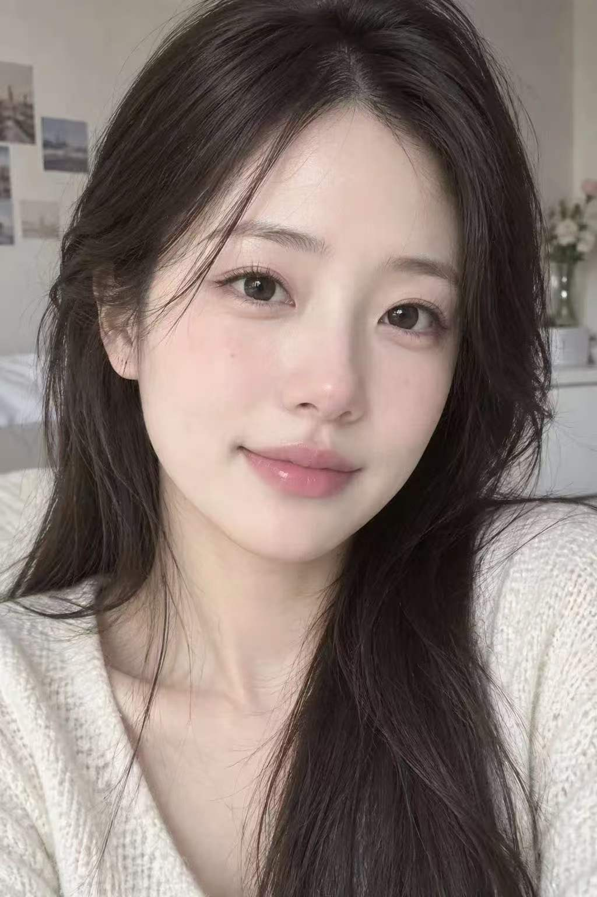
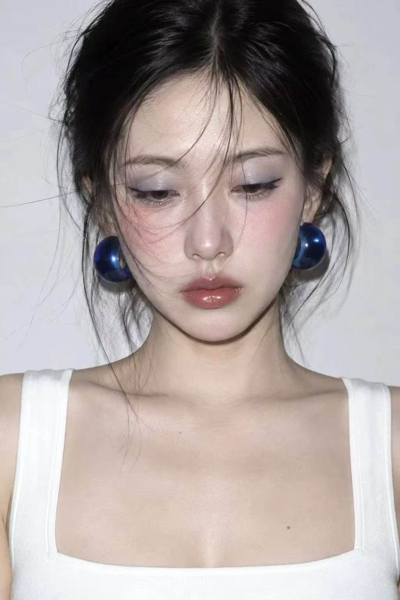
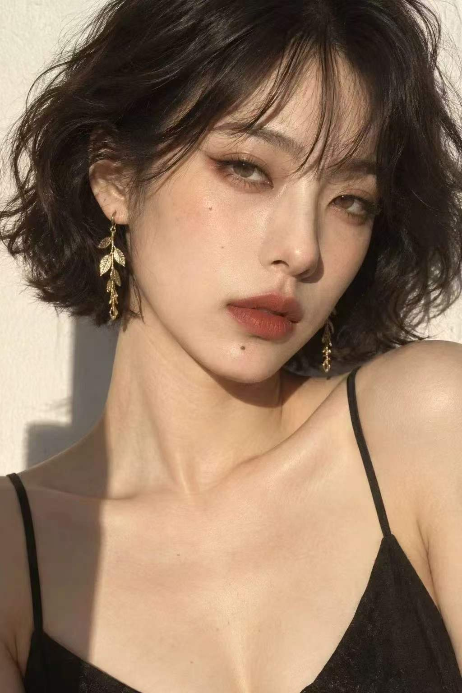
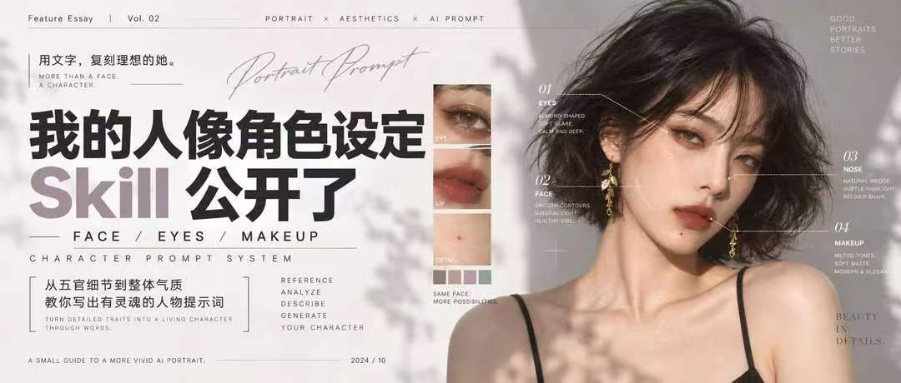

# 人像模拟师

把一句自然语言的人物设想，整理成可执行的人像设计，并在支持生图的平台中直接生成图片。

[](https://github.com/zix102834-prog/portrait-simulator-skill/stargazers)
[](https://github.com/zix102834-prog/portrait-simulator-skill/issues)
[](https://github.com/zix102834-prog/portrait-simulator-skill/commits/main)

如果这个 Skill 对你有用，可以点亮一个 [Star](https://github.com/zix102834-prog/portrait-simulator-skill)，方便以后找到，也帮助更多需要人像提示词与情绪设计的人发现它。

## 它能做什么

- **描述人物，直接出图**：用户只需要说年龄、气质、五官、妆发或场景，不必先学习提示词。
- **没有参考图也能使用**：根据用户描述、可替换变量和内部参考素材动态组合合理设定。
- **人物与表情一体化设计**：把人物外形、情绪动机和外在表达放进同一张人像中。
- **支持同一人物多表情**：锁定角色 DNA、妆发、服装、构图和光影，只替换情绪与表情模块。
- **新手一次性引导**：当使用者没有概念时，一次列出可选条件；未填写的部分可由 Skill 自动决定。
- **按需输出提示词**：只有用户主动要求时，才显示完整版、精简版、英文增强版或负面提示词。

## 内置视觉参考

这些图片只用于帮助 Skill 理解可迁移的人像规律，不要求用户提交参考图，也不用于复刻图片中人物的真实身份。

| 自然清透生活感 | 冷感闪光灯妆容 |
| --- | --- |
|  |  |

| 暖光电影杂志感 | 杂志版式与拆解示例 |
| --- | --- |
|  |  |

## 安装

### 让 Codex 帮你安装

把下面这句话发给 Codex：

```text
请从 https://github.com/zix102834-prog/portrait-simulator-skill 安装这个 Skill。
```

### 手动安装

1. 下载或克隆本仓库。
2. 将整个文件夹放入 Codex 的 Skills 目录，并保留 `SKILL.md`、`agents/` 和 `references/` 的相对结构。
3. 文件夹建议命名为 `portrait-prompt-crafter`，调用名称保持为 `$portrait-prompt-crafter`。

## 怎么使用

直接描述想要的人物即可。信息不足时，Skill 会补全相容的妆发、服装、光影和镜头设定；在支持生图的平台中，默认直接生成图片。

### 示例 1：一句话直接出图

```text
使用 $portrait-prompt-crafter，生成一个25岁的东南亚女性，黑色长发，单眼皮，甜美自然，暖白室内光，上半身生活感人像。
```

### 示例 2：人物和情绪一起生成

```text
使用 $portrait-prompt-crafter，生成一位30岁的亚洲女性，轻熟、圆润脸、蓬松短发、日杂清透妆。她刚听到一句温柔的肯定，想保持平静，但眼神里有放松和惊喜。冷白硬光，自拍感近景，杂志封面气质。
```

### 示例 3：只要提示词

```text
使用 $portrait-prompt-crafter，为一位25岁的金发碧眼欧洲女性写精简版正向提示词和负面提示词。气质冷艳，千金名媛感，摄影棚柔光，85mm 半身肖像。不要生成图片。
```

如果不知道如何描述，可以直接说：

```text
使用 $portrait-prompt-crafter。我没有明确概念，请一次性列出需要选择的人像和表情条件，没填的部分由你决定。
```

## 工作逻辑

```text
自然语言需求
  → 角色 DNA（年龄感、脸型、五官、辨识点）
  → 妆发、服装与风格模块
  → 情绪动机、外在表达与可见痕迹
  → 镜头、光影、背景与画质约束
  → 直接生成图片或按需输出 Prompt
```

人物和表情既可以合并成一条完整 Prompt，也可以拆成“人物基础 Prompt + 表情模块”。需要同一角色生成多种情绪时，优先使用拆分模式。

## 文件结构

```text
portrait-prompt-crafter/
├── SKILL.md
├── agents/
│   └── openai.yaml
└── references/
    ├── 01-natural-lifestyle-portrait.jpg
    ├── 02-cool-flash-beauty.jpg
    ├── 03-warm-cinematic-editorial.jpg
    ├── 04-editorial-layout-reference.jpg
    ├── emotional-expression-rules.md
    ├── portrait-intake-agent.md
    └── precision-design-rules.md
```

## 使用边界

- 所有人物示例均按成年人设计。
- 参考图片是审美样本，不用于识别、冒充或复刻真实人物身份。
- 同一角色的一致性受生成模型能力影响，Skill 会提供稳定锚点，但不承诺像素级一致。
- 负面提示词只在所用生成模型支持时生效。
- 仓库当前未提供 `LICENSE`，因此不要默认其授权范围或商业使用权限。

## 反馈与支持

发现问题或有新的风格需求，可以提交 [Issue](https://github.com/zix102834-prog/portrait-simulator-skill/issues)。如果你希望继续关注更新，可以 Star 或 Watch 本仓库。
